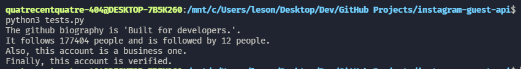

# Instagram Guest API
This API is unofficial. It allows you to interact with many things that your browser displays such as likes, followers, biography, websites, comments, and more. The goal is to access these data without haivng to login.

# Installation
```bash
git clone https://github.com/quatrecentquatre-404/instagram-guest-api.git
cd instagram-guest-api
chmod +x ./build.bash
./build.bash
```

# Example
If you run the ``tests/tests.py`` script, you may see this result :

